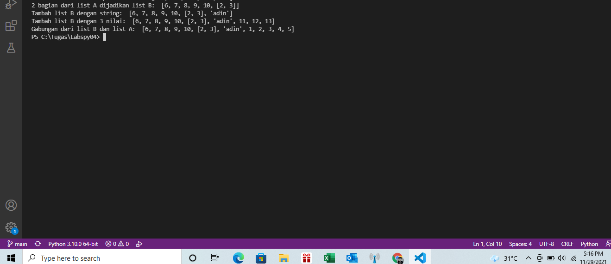
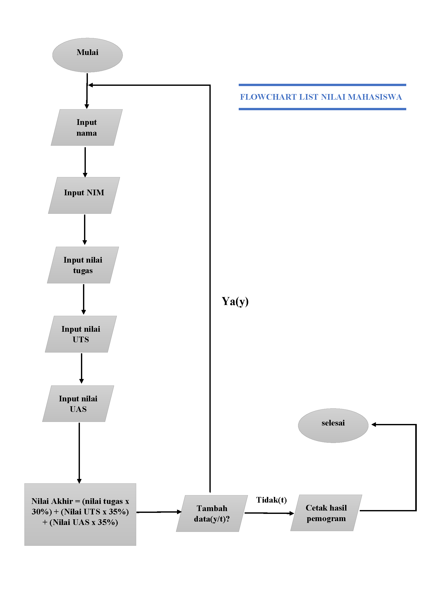
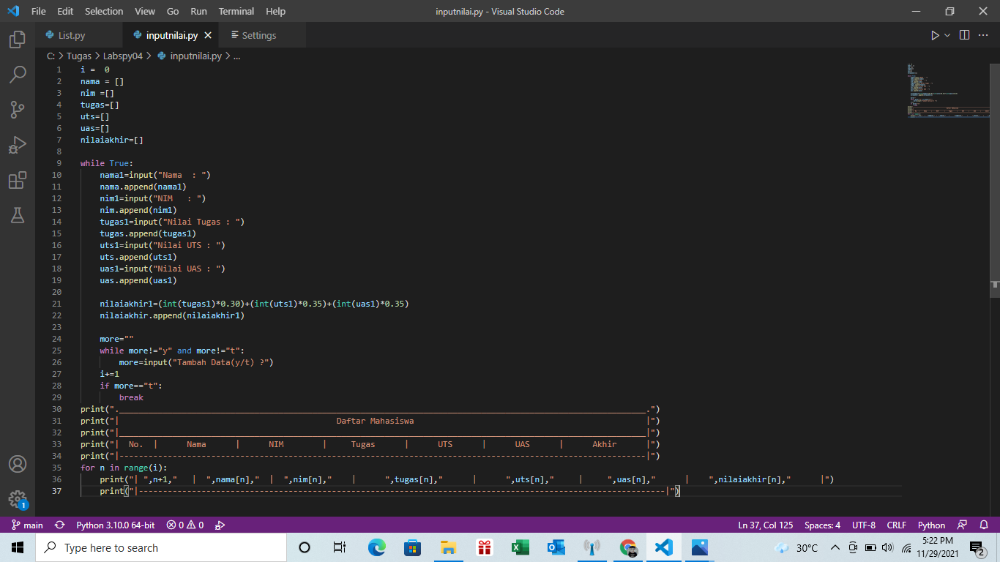

# Labspy04
# latihan1
### Bentuk program di latihan1 yang saya buat

### dengan keterangan 
- > list=["a", "r","t","u","n"]
- diatas adalah isi list nya
- > print("Tampilkan elemen ke3: ",list[2])
- diatas adalah perintah untuk menampilkan elemen ke3 dalam daftar, karna elemen ke3 ada di indeks 2, maka didalam daftar paje kurung siku[2]
- > print("Ambil elemen ke2 sampai ke4: ", list[1:4])
- diatas adalah perintah untuk mengambil elemen ke2 sampai ke4 dengan indeks 1 sampai 4
- > print("Ambil elemen terakhir: ", list[-1])
- sedangkan diatas adalah perintah untuk mengambil elemen terakhir dengan indeks [-1] karna -1 itu keebalikannya, jadi ngambilnya dari akhir
### Mengubah elemen ke4 dengan nilai lain
- > list[3] = "f" 
- perintah di atas adalah unntuk mmerubah elemen ke4 dengan nilai "f" karna elemen ke4 ada di indeks 3, maka di tulis list[3]
- > print ( " Menambahkan elemen ke4 dengan nilai lain", list )
### Mengubah elemen ke4 sampai terakhir
- > list[3:] = "s","d"
- Perintah ini untuk merubah elemen ke4 sampai terkahir dengan string "s" dan "d". Maka ditulis [3:]
- > print ( "Merubah elemen ke4 sampai terakhir:", list)
### Berikut hasil pemrogamannya


## Latihan untuk menambahkan elemen dalam daftar 
### Berikut gambar programnnya:

...python
a=[1,2,3,4,5]
b=[6,7,8,9,10]
...
- diatas adalah list nya
### Mengambili 2 bagian dari list A ke list B
...python
b.append(a[1:3])
print ("2 bagian list A dijadikan list B:",b)
...
- diatas adalah program untuk menambahkan list A kedalam list dengan menggunakan printah append
### Menambahkan list B dengan string
...pyton
b.append("adin")
print("Tambah list B dengna string:" )
...
- program diatas adalah untuk menambahkan list B dengan string menggunakan append
### Menambahkann daftar B dengan 3 nilai
...pyton
print(""Tambah list B dengan 3 nilai: ", b + [11,12,13])
...
- diatas adalah program untuk menambahkan list b dengan 3 nilai dengan menggunakan aritmatika +

### Menggabungkan list A dan B
...pyton
c=b+_a
print("Gabungan list B dan A:", c)
...
- diatas adalah program untuk menggabungkan list B dengan list A
## Berikut hasil dari programnnya:

# Program dari latihan1 telah selesai


# Membuat List Nilai Mahasiswa
### Berikut flowchartnya:

### Berikut Programnya:

### keterangan
> i=0
- diatas adalah untuk menginisiasikan variable i sama dengan 0, karena diprogram ini akan menggunakan perulangan while dan for, jadi perlu menginisiasikan agar tidak terjadi eror
> nama = []
> nim =[]
> tugas=[]
> uts=[]
> uas=[]
> nilaiakhir=[]
- Program di atas untuk mendefinisikan list nya, dan untuk menampung data
> while True:
>>>>nama1=input("Nama  : ")
>>>>nama.append(nama1)
>>>>nim1=input("NIM   : ")
>>>>nim.append(nim1)
>>>>tugas1=input("Nilai Tugas : ")
    
>>>>tugas.append(tugas1)
    
>>>>uts1=input("Nilai UTS : ")
    
>>>>uts.append(uts1)
    
>>>>uas1=input("Nilai UAS : ")
 
>>>>uas.append(uas1)
nilaiakhir1=(int(tugas1)*0.30)+(int(uts1)*0.35)+(int(uas1)*0.35)
    nilaiakhir.append(nilaiakhir1)

    more=""
    while more!="y" and more!="t":
        more=input("Tambah Data(y/t) ?")
    i+=1
    if more=="t":
        break
print("._____________________________________________________________________________________________________________.")
print("|                                             Daftar Mahasiswa                                                |")
print("|_____________________________________________________________________________________________________________|")
print("|  No.  |      Nama      |      NIM        |     Tugas      |      UTS      |      UAS      |      Akhir      |")
print("|-------------------------------------------------------------------------------------------------------------|")
for n in range(i):
    print("| ",n+1,"   |  ",nama[n],"  |  ",nim[n],"    |      ",tugas[n],"      |      ",uts[n],"     |     ",uas[n],"      |    ",nilaiakhir[n],"      |")
    print("|-------------------------------------------------------------------------------------------------------------|") 

```
- untuk membuat border agar terlihat rapi dan enak dipandang
```python
for n in range(i):
    print("| ",n+1,"   |  ",nama[n],"  |  ",nim[n],"    |      ",tugas[n],"      |      ",uts[n],"     |     ",uas[n],"      |    ",nilaiakhir[n],"      |")
    print("|-------------------------------------------------------------------------------------------------------------|")
```
- sedangkan ini adalah untuk menampilkan hasil dari list yang telah diinputkan, dengan menggunakan perulangan for n in renge
### Berikut hasil dari programnya

## Selesai
# sekian Terimakasih 
